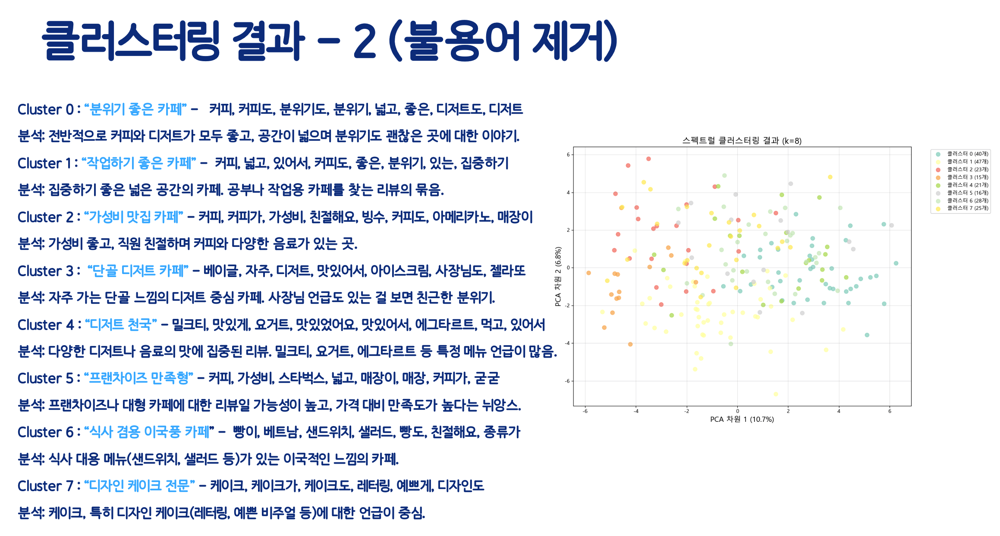

### 주제

NLP기반 감정분석과 임베딩 모델을 활용한 카페 분류 프로젝트
 

건국대학교 경영학과 데이터 기반 의사결정 (이명구 교수님 - 경영학과)

### 목적

사람들이 매번 카페를 갈 때 공부를 하러 가거나, 수다를 떨러 가는 등 다양한 목적이 있다. 하지만, 카페를 검색하면 다양한 특성의 카페들이 동시에 나오기에, 소비자가 직접 찾아야 한다. 이러한 문제를 해결하고자, 개별 카페들이 가진 고유한 특징을 자동으로 분류하는 시스템을 만드는 것. 
이를 통해 사용자는 목적에 맞는 카페를 더 쉽게 탐색할 수 있고, 데이터 기반의 상권 분석에도 응용할 수 있다.

### 사용 데이터 및 기술

1. 크롤링 데이터

| 파트 | 사용 도구 |
| --- | --- |
| 크롤링 | Selenium, BeautifulSoup, Requests |
| NLP | KoNLPy, KeyBERT, Transformers(Huggingface), SBERT |
| 머신러닝 | Scikit-learn, Gensim (LDA), KMeans |
| 시각화 | Matplotlib, Seaborn, WordCloud, Plotly |
| 환경 | Python, Jupyter Notebook / Google Colab |

 

### 참고

https://github.com/cabojago/cabojago

### 플로우

**가설 설정**

1 . 카페의 리뷰 데이터는 그 카페의 특성을 반영할 것이다. 
ex> 만약 디저트 맛집으로 유명한 카페가 있다면, 그 카페의 리뷰글에서 “디저트”라는 단어가 가장 많이 발견될 것이다. 

2 . 각각의 카페는 유사한 리뷰들로 구성되어 있을 것이다. 
ex> 공부하기 좋은 카페가 있다면, 다수가 비슷한 후기를 남겼을 것이다.

3 . 임베딩 기반 클러스터링은 키워드 방식보다 문장의 의미적 유사도를 포착하는 데 유리하며, 리뷰의 뉘앙스와 맥락을 고려한 테마 분류가 가능하다. 따라서, 이 프로젝트에서는 문장 임베딩 기반 클러스터링 방식이 더 효과적일 것이다

**데이터 수집**

→ 네이버지도 및 블로그 크롤링, 카카오맵 크롤링, 케글 데이터 사용(가능하면)

| 카페 이름 | 주소 | 리뷰 원문 | 리뷰 키워드 | 평점 |
| --- | --- | --- | --- | --- |
| ***카페A*** | 서울 광진구... | "공부하기 너무 좋아요. 조용하고 콘센트도 많아요!" | 공부, 조용함, 콘센트 | 4.5 |

**데이터 전처리(필터링)**

비정형 데이터로서, 이상치 or 결측치 등은 존재 x  다만 필터링 필요

전처리 단계에서 감정 분석을 하려는 이유

- "콘센트가 없어요" → 콘센트 언급 있음 → 키워드 ‘콘센트’ 카운트 증가 → 카공하기 좋은 카페로 분류될 수 있음  하지만 의미는 '콘센트 없음' (부정) → "카공에 부적절"해야 맞음
- 이런 현상을 해결하기 위해
    - 1차적으로 감정빈도 분석을 통해 부정적인 카페가 있다면 제외
    - 2차적으로 부정적인 리뷰는 제외하거나 클러스터링에서 분류에 부정적인 영향을 미치도록 설계

**분류 방안 1 - 임베딩 모델 적용**
- Ko-Sentence-BERT와 같은 사전학습 모델을 이용:
- 통합된 리뷰 문단 → 고차원 임베딩 벡터로 변환
- 토크나이징: 문단을 토큰(단어 또는 하위 단어) 단위로 분해함. ["말차", "빙수", "는", "위", "에", "연유", "가", "뿌려져", "있어서", "달콤한", ...]
Transformer Encoding: 각각의 토큰에 대해 벡터(예: 768차원)를 생성
- 이 벡터들은 카페 리뷰의 주제적 의미를 반영
이후 KMeans, Spectral Clustering 등 다양한 알고리즘을 적용해 자동 분류

**임베딩 모델 단점 발견**
 
우리가 원하는 카테고리로 분류를 하기 어렵다. 
 → 문장 임베딩 기반 클러스터링은 데이터의 의미적 유사성을 바탕으로 자동으로 묶는 방식이기 때문에 우리가 *명확하게 원하는 카테고리(ex. 데이트카페, 카공카페, 뷰맛집)와 정확히 일치하지 않을 수 있음.

클러스터링 결과를 “왜 이렇게 묶였는지” 사람이 직관적으로 해석하기 어렵다
 → 임베딩 후 클러스터링된 결과는 각 군집의 중심이 고차원 벡터이기 때문에 “왜 이 카페들이 같은 군집으로 묶였는가?”를 사람 눈으로 바로 이해하기 어렵다

**분류 방안 2 - 키워드 분석**
 
 리뷰에서 형태소 분석기로 명사와 형용사를 추출
 키워드를 정의 (커피 맛집 → 진하다, 향, 드립커피 등 포함)
 리뷰에서 제일 많이 나온 키워드를 토대로 테마 분류 (진하다, 깊다, 고소하다 → 커피맛집으로 분류 )
 각 테마별로 키워드 등장 순위를 정하고 5등까지 출력

 

 **결론 도출**
  
 단순한 키워드 검색을 넘어, 리뷰 속에 담긴 문맥과 분위기를 정략적으로 이해하여 카페를 의미적으로 분류하는 시도
텍스트 임베딩과 클러스터링을 활용한 이 방법은 소비자 취향을 반영한 맞춤형 탐색 서비스나 상권 분석 도구로 확장 가능함
임베딩 방식과 키워드 방식 중 임베딩 방식이 더 좋을 것이라는 가설을 세웠으나, 결과값이 좋지 않았음
그래서 키워드 방식을 사용했더니 좋은 결과값이 나왔음
